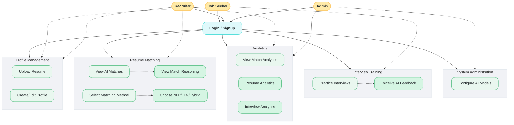
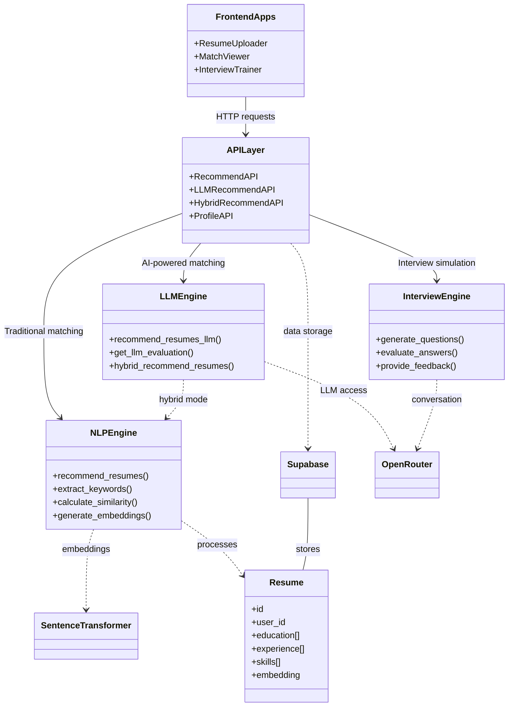
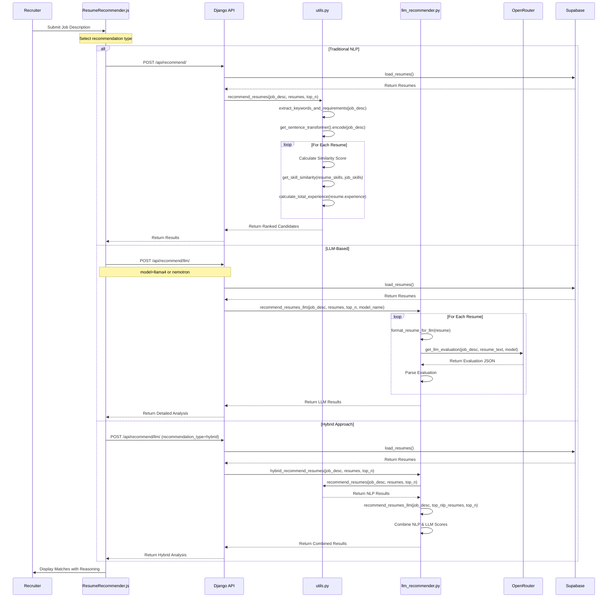
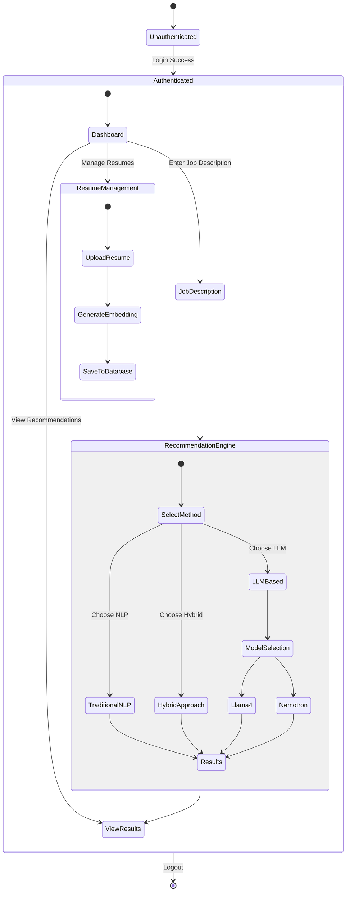
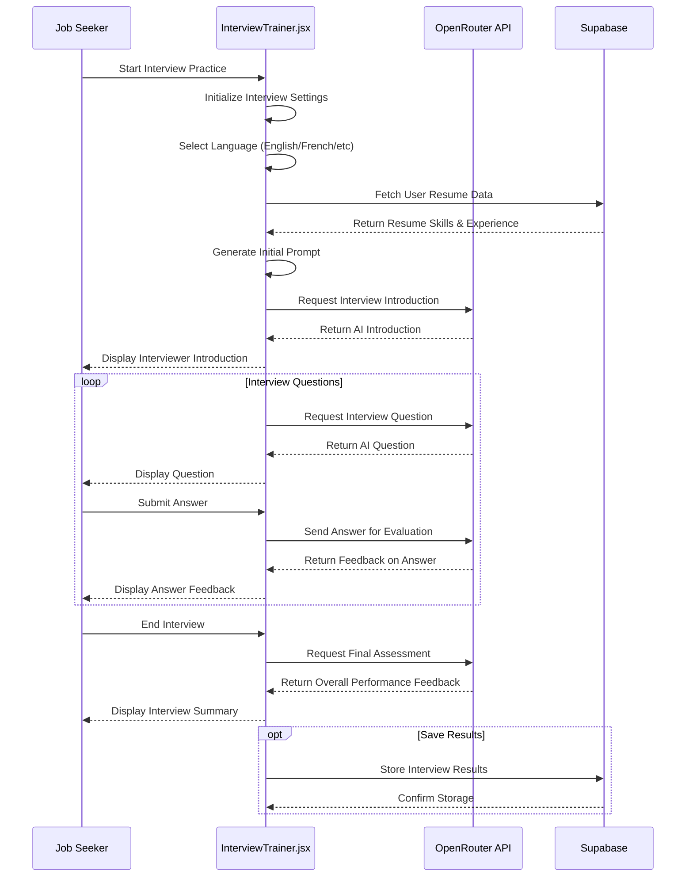

# QuirkHire System Diagrams (CareerReco)

## 1. Use Case Diagram

**Description:** This use case diagram illustrates the main interactions between users and the QuirkHire system. It shows three primary actors (Job Seekers, Recruiters, and Admins) and their respective system functions. Job Seekers can upload resumes, create profiles, and practice interviews with AI feedback, while Recruiters can view AI-powered matches, view analytics, and select matching methods. Admins maintain system configuration including AI model settings. The extensions show specialized features like viewing match reasoning, choosing between different recommendation approaches (NLP, LLM, or Hybrid), and receiving AI feedback on interview responses.

## 2. Class Diagram

**Description:** This simplified class diagram shows the essential components of the QuirkHire system at a high level. The Resume class forms the core data structure, containing education, experience, skills and embeddings. The system is organized into three main layers: (1) FrontendApps that users interact with, including resume uploading, match viewing, and interview training; (2) an APILayer that provides endpoints for the different functionalities; and (3) three core engines - the NLPEngine for traditional matching, the LLMEngine for AI-powered matching, and the InterviewEngine for practice interviews. The diagram also shows the key external services: Supabase for data storage, OpenRouter for accessing LLM models, and SentenceTransformer for generating embeddings. The relationships clearly illustrate how the components work together - for example, how the LLMEngine connects to OpenRouter and uses the NLPEngine in hybrid mode, or how the InterviewEngine generates questions and provides feedback using OpenRouter.

## 3. Sequence Diagram: Resume Matching Process

**Description:** This sequence diagram provides a detailed view of the actual code execution flow in the QuirkHire system based on code analysis. It accurately shows how each recommendation method works at the function level. For the Traditional NLP approach, it demonstrates how utils.py handles the recommendation process through specific functions like extract_keywords_and_requirements and get_skill_similarity. For the LLM-Based approach, it shows how llm_recommender.py formats resumes and sends them to OpenRouter for evaluation. The Hybrid Approach section accurately reflects how hybrid_recommend_resumes() first gets NLP recommendations and then enhances them with LLM insights. The diagram correctly shows which API endpoints handle each request type and the exact flow of data between components.

## 4. Component Diagram

```mermaid
graph TD
    %% Component styling
    classDef frontendComponent fill:#d4f1f9,stroke:#2980b9,stroke-width:2px,color:#333
    classDef backendComponent fill:#d5f5e3,stroke:#27ae60,stroke-width:2px,color:#333
    classDef dataComponent fill:#fdebd0,stroke:#e67e22,stroke-width:2px,color:#333
    classDef externalComponent fill:#ebdef0,stroke:#8e44ad,stroke-width:2px,color:#333
    
    %% Frontend Components (based on actual pages)
    subgraph FrontendComponents["Frontend Components"]
        direction LR
        HomePage["HomePage.js"]:::frontendComponent
        ResumeCreator["CreateResumePage.js"]:::frontendComponent
        ResumeRecommender["ResumeRecommender.js"]:::frontendComponent
        InterviewTrainer["InterviewTrainer.jsx"]:::frontendComponent
        AdminDashboard["AdminDashboard.jsx"]:::frontendComponent
        ResumeDashboard["AdminResumeDashboard.jsx"]:::frontendComponent
        ProfilePages["ProfilePages"]:::frontendComponent
        AuthPages["Authentication Pages"]:::frontendComponent
    end
    
    %% Backend Components (based on actual views and utils)
    subgraph BackendComponents["Backend Components"]
        direction TB
        
        %% API Endpoints
        subgraph APIEndpoints["API Endpoints"]
            direction LR
            RecommendAPI["RecommendAPI"]:::backendComponent
            LLMRecommendAPI["LLMRecommendAPI"]:::backendComponent
            ProfileAPI["ProfileAPI"]:::backendComponent
            EmbeddingAPI["GenerateEmbeddingAPI"]:::backendComponent
            AuthAPI["Authentication APIs"]:::backendComponent
        end
        
        %% Core Services
        subgraph CoreServices["Core Services"]
            direction LR
            Utils["utils.py"]:::backendComponent
            LLMRecommender["llm_recommender.py"]:::backendComponent
            SentenceTransformer["SentenceTransformer"]:::backendComponent
            SpacyNLP["Spacy NLP"]:::backendComponent
        end
    end
    
    %% External Services (based on actual integrations)
    subgraph ExternalServices["External Services"]
        direction LR
        OpenRouter["OpenRouter API"]:::externalComponent
        Llama4["Meta Llama 4"]:::externalComponent
        Nemotron["Nemotron 49B"]:::externalComponent
        HuggingFace["HuggingFace Hub"]:::externalComponent
    end
    
    %% Data Storage
    subgraph DataStorage["Data Storage"]
        direction LR
        SupabaseDB["Supabase"]:::dataComponent
        Profiles["Profiles Table"]:::dataComponent
        Resumes["Resumes Table"]:::dataComponent
        Embeddings["Resume Embeddings"]:::dataComponent
    end
    
    %% Connections between components (based on actual calls)
    %% Frontend to Backend
    ResumeRecommender --> RecommendAPI
    ResumeRecommender --> LLMRecommendAPI
    ResumeCreator --> EmbeddingAPI
    InterviewTrainer --> OpenRouter
    InterviewTrainer --> SupabaseDB
    ProfilePages --> ProfileAPI
    AuthPages --> AuthAPI
    ResumeDashboard --> SupabaseDB
    
    %% Backend internal connections
    RecommendAPI --> Utils
    LLMRecommendAPI --> LLMRecommender
    LLMRecommendAPI --> Utils
    EmbeddingAPI --> Utils
    EmbeddingAPI --> SentenceTransformer
    
    %% Core dependencies
    Utils --> SentenceTransformer
    Utils --> SpacyNLP
    LLMRecommender --> OpenRouter
    SentenceTransformer --> HuggingFace
    SpacyNLP --> HuggingFace
    
    %% External connections
    OpenRouter --> Llama4
    OpenRouter --> Nemotron
    
    %% Data connections
    Utils --> Resumes
    LLMRecommender --> Resumes
    ProfileAPI --> Profiles
    EmbeddingAPI --> Embeddings
    
    %% Data relationships
    SupabaseDB --> Profiles
    SupabaseDB --> Resumes
    Resumes --> Embeddings
    
    %% Styling
    style FrontendComponents fill:#eef7fb,stroke:#2980b9,stroke-width:1px
    style BackendComponents fill:#eafaf1,stroke:#27ae60,stroke-width:1px
    style APIEndpoints fill:#eafaf1,stroke:#27ae60,stroke-width:1px,stroke-dasharray: 5 5
    style CoreServices fill:#eafaf1,stroke:#27ae60,stroke-width:1px,stroke-dasharray: 5 5
    style DataStorage fill:#fef5e7,stroke:#f39c12,stroke-width:1px
    style ExternalServices fill:#f4ecf7,stroke:#8e44ad,stroke-width:1px
```

**Description:** This component diagram reflects the actual files and components found in the codebase. The frontend section shows the specific React pages found in the frontend/src/pages directory, including HomePage.js, CreateResumePage.js, ResumeRecommender.js, and the admin dashboard components. The backend components are organized into API endpoints (directly matching the classes in views.py) and core services (matching the actual utility modules). The diagram shows accurate data flows based on code analysis - how ResumeRecommender.js calls the appropriate APIs, how the embedding generation works, and how utils.py and llm_recommender.py interact with external services and data storage. The data storage section accurately represents the Supabase tables used in the system, and the external services section shows the specific AI models and services integrated via OpenRouter.

## 5. State Diagram: Application State

**Description:** The state diagram visualizes the different states and transitions a user experiences when interacting with the QuirkHire system. Starting from the unauthenticated state, users can authenticate to access the dashboard. From there, they can manage resumes (upload, generate embeddings, save), enter job descriptions, or view recommendation results. The diagram highlights the recommendation engine states, showing how users can select different matching methods (Traditional NLP, LLM-Based, or Hybrid) and, when choosing LLM-Based, select specific models (Llama4 or Nemotron). This diagram is particularly useful for understanding the user journey and the different paths they can take within the application.

## Usage Notes

These diagrams use Mermaid.js syntax and can be rendered in:
- GitHub Markdown files
- VS Code with Mermaid extension
- Mermaid Live Editor (https://mermaid.live/)
- Any markdown viewer with Mermaid support

### QuirkHire System-Specific Notes

These diagrams represent the CareerReco project architecture, which includes:

1. **Traditional NLP Pipeline**:
   - Uses Sentence Transformers (all-MiniLM-L6-v2) to generate embeddings
   - Performs semantic similarity matching via cosine similarity
   - Analyzes structured fields like education, skills, and experience

2. **LLM-Based Pipeline**:
   - Connects to OpenRouter API
   - Uses Meta Llama 4 Maverick or NVIDIA Nemotron Super 49B
   - Provides detailed reasoning and analysis of candidate fit

3. **Hybrid Approach**:
   - Combines both NLP and LLM results with configurable weights
   - Weights traditional and AI-based scores for optimal results
   - Delivers faster results with deep, explainable insights

To update these diagrams, modify the Mermaid code blocks above.

## 6. Interview Trainer Sequence Diagram

**Description:** This sequence diagram shows the interview training process implemented in InterviewTrainer.jsx. The job seeker initiates an interview practice session, selecting language preferences. The system fetches the user's resume data from Supabase to personalize the interview. The interview proceeds through a loop of AI-generated questions, user answers, and AI feedback on those answers. Throughout the process, the InterviewTrainer component communicates directly with the OpenRouter API to leverage LLM capabilities for generating realistic interview questions and providing insightful feedback on user responses. At the end, the system provides a comprehensive assessment of the user's interview performance and optionally saves the results.

## 7. Physical Architecture Diagram

```mermaid
flowchart TD
    %% Node styling
    classDef browser fill:#f5f5f5,stroke:#333,stroke-width:1px
    classDef frontend fill:#d4f1f9,stroke:#2980b9,stroke-width:2px
    classDef backend fill:#d5f5e3,stroke:#27ae60,stroke-width:2px
    classDef database fill:#fdebd0,stroke:#e67e22,stroke-width:2px
    classDef external fill:#ebdef0,stroke:#8e44ad,stroke-width:2px
    classDef compute fill:#f9ebea,stroke:#c0392b,stroke-width:2px
    classDef storage fill:#eaeded,stroke:#7f8c8d,stroke-width:2px
    
    %% Client tier
    Browser["Web Browser"]:::browser
    
    %% Frontend tier
    subgraph FrontendTier["Frontend Tier"]
        direction LR
        ReactApp["React Application"]:::frontend
        MUIComponents["Material UI Components"]:::frontend
        ContextAPI["React Context API"]:::frontend
        StaticAssets["Static Assets"]:::storage
    end
    
    %% API tier
    subgraph APITier["API Tier"]
        direction LR
        Nginx["Nginx Web Server"]:::compute
        Gunicorn["Gunicorn WSGI Server"]:::compute
        DjangoApp["Django Application"]:::backend
        RESTFramework["Django REST Framework"]:::backend
        CORS["CORS Middleware"]:::backend
    end
    
    %% Application tier
    subgraph AppTier["Application Tier"]
        direction TB
        %% Core components
        subgraph RecommenderEngine["Recommender Engine"]
            direction LR
            NLPRecommender["Traditional NLP Recommender"]:::backend
            LLMRecommender["LLM Recommender"]:::backend
            HybridRecommender["Hybrid Recommender"]:::backend
        end
        
        %% ML components
        subgraph MLComponents["ML Components"]
            direction LR
            SentenceTransformer["Sentence Transformer"]:::compute
            SpacyNLP["Spacy NLP"]:::compute
            ScikitLearn["Scikit-Learn"]:::compute
        end
        
        %% Auth components
        AuthService["Authentication Service"]:::backend
        ProfileService["Profile Service"]:::backend
    end
    
    %% Data tier
    subgraph DataTier["Data Tier"]
        direction LR
        SupabaseDB["Supabase PostgreSQL"]:::database
        VectorStorage["Vector Embeddings"]:::database
        CacheLayer["Redis Cache"]:::database
        ObjectStorage["Object Storage"]:::storage
    end
    
    %% External services
    subgraph ExternalServices["External Services"]
        direction LR
        OpenRouter["OpenRouter API Gateway"]:::external
        Llama4["Meta Llama 4 Maverick"]:::external
        Nemotron["NVIDIA Nemotron 49B"]:::external
        HuggingFace["HuggingFace Hub"]:::external
    end
    
    %% Connections between tiers
    Browser <--> ReactApp
    ReactApp <--> MUIComponents
    ReactApp <--> ContextAPI
    ReactApp <--> StaticAssets
    
    ReactApp <--> Nginx
    Nginx <--> Gunicorn
    Gunicorn <--> DjangoApp
    DjangoApp <--> RESTFramework
    RESTFramework <--> CORS
    
    RESTFramework <--> NLPRecommender
    RESTFramework <--> LLMRecommender
    RESTFramework <--> HybridRecommender
    RESTFramework <--> AuthService
    RESTFramework <--> ProfileService
    
    NLPRecommender <--> SentenceTransformer
    NLPRecommender <--> SpacyNLP
    NLPRecommender <--> ScikitLearn
    
    HybridRecommender <--> NLPRecommender
    HybridRecommender <--> LLMRecommender
    
    LLMRecommender <--> OpenRouter
    OpenRouter <--> Llama4
    OpenRouter <--> Nemotron
    
    SentenceTransformer <--> HuggingFace
    SpacyNLP <--> HuggingFace
    
    AuthService <--> SupabaseDB
    ProfileService <--> SupabaseDB
    NLPRecommender <--> SupabaseDB
    NLPRecommender <--> VectorStorage
    LLMRecommender <--> SupabaseDB
    
    DjangoApp <--> CacheLayer
    
    %% Styling
    style FrontendTier fill:#eef7fb,stroke:#2980b9,stroke-width:1px
    style APITier fill:#eafaf1,stroke:#27ae60,stroke-width:1px
    style AppTier fill:#e8f8f5,stroke:#16a085,stroke-width:1px
    style DataTier fill:#fef5e7,stroke:#f39c12,stroke-width:1px
    style ExternalServices fill:#f4ecf7,stroke:#8e44ad,stroke-width:1px
    style RecommenderEngine fill:#e8f8f5,stroke:#16a085,stroke-width:2px,stroke-dasharray: 5 5
    style MLComponents fill:#ebf5fb,stroke:#3498db,stroke-width:2px,stroke-dasharray: 5 5
```

This physical architecture diagram reflects the actual implementation of the QuirkHire system based on project files analysis. It shows:

- **Client Tier**: Web browsers accessing the application
- **Frontend Tier**: React application with Material UI components and React Context for state management
- **API Tier**: Nginx and Gunicorn serving the Django application with REST Framework
- **Application Tier**: 
  - Core recommender engines (Traditional NLP, LLM, and Hybrid)
  - ML components using Sentence Transformers, Spacy, and Scikit-Learn
  - Authentication and profile services
- **Data Tier**: Supabase PostgreSQL database, vector storage, caching layer, and object storage
- **External Services**: OpenRouter API gateway connecting to LLM models (Llama 4 and Nemotron) and HuggingFace Hub

The diagram illustrates the complete flow from user interface through the backend services to the data storage and external AI services.

**Description:** This detailed physical architecture diagram maps the actual implementation of the QuirkHire system based on the project codebase analysis. It shows the concrete technologies and services that make up each tier of the application. Starting from the client browser, the diagram traces the request flow through the React frontend with Material UI components, through the API tier with Nginx and Gunicorn, into the application tier with the three recommender engines, and finally to the data storage tier with Supabase. The diagram also shows the integration with external AI services via OpenRouter. Color-coding helps distinguish different types of components (frontend, backend, database, external services), while the connections between components illustrate data flow paths. This diagram provides a comprehensive view of how the system is physically implemented and deployed.
