# QuirkHire: Advanced Resume Recommendation System

## Project Overview
QuirkHire is an innovative resume recommendation platform that leverages cutting-edge natural language processing and large language model technologies to provide intelligent, context-aware candidate matching. The system combines traditional NLP techniques with advanced LLM capabilities to deliver comprehensive, explainable candidate recommendations.

## CRISP-DM Methodology

This project follows the Cross-Industry Standard Process for Data Mining (CRISP-DM) methodology, which provides a structured approach to planning and implementing data science projects. Below is a breakdown of how each phase was implemented:

### 1. Business Understanding

#### Problem Statement
- Recruiters face challenges in efficiently matching job descriptions with qualified candidates
- Traditional keyword-based systems fail to capture semantic similarity and context
- Manual resume screening is time-consuming and subjective
- Explainability of matches is often lacking in automated systems

#### Objectives
- Develop an intelligent resume recommendation system with high match accuracy
- Implement both traditional NLP and cutting-edge LLM approaches
- Create a user-friendly interface for job posting and candidate discovery
- Provide detailed reasoning for match recommendations
- Support multiple recommendation modes to balance speed and accuracy

#### Success Criteria
- Improved match relevance compared to keyword-based systems
- Detailed, context-aware explanations for each recommendation
- Positive user feedback on recommendation quality
- Scalable system capable of handling numerous resumes and job descriptions

### 2. Data Understanding

#### Data Sources
- User-uploaded resumes
- Structured profiles stored in Supabase
- Job descriptions entered by recruiters
- Synthetic AI-generated test data (resumes_no_embeddings.csv)

#### Data Exploration
- Analysis of resume structures and common fields
- Identification of key job description components
- Skill taxonomy development
- Categorization of experience levels and educational qualifications

#### Data Quality Assessment
- Handling of missing resume sections
- Standardization of skills and experience descriptions
- Validation of resume completeness
- User profile data completeness analysis

## CRISP-DM Implementation Cycle

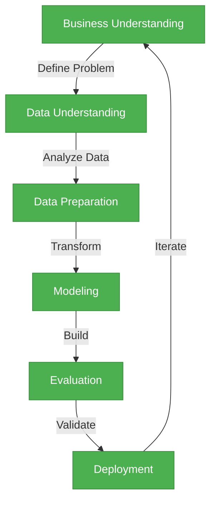

### 3. Data Preparation

#### Feature Engineering
- Text preprocessing for NLP analysis
- Resume standardization and structuring
- Contextual embedding generation
- LLM-ready formatting of resumes and job descriptions

#### Data Transformation
- Vector embeddings generation using sentence-transformers
- Structured JSON formatting for LLM processing
- Experience duration calculation
- Skill categorization and normalization

#### Data Storage
- Supabase database for user profiles and resumes
- Vector embeddings stored with resumes
- Cached LLM evaluations for performance optimization

### 4. Modeling

#### Traditional NLP Approach
- Sentence transformer embeddings (all-MiniLM-L6-v2)
- Cosine similarity calculation
- Weighted scoring based on skills, experience, and education
- Contextual enhancement of resume embeddings

#### LLM-Based Approach
- Integration with OpenRouter API for LLM-based matching
- Support for multiple LLM models (Llama 4 Maverick, NVIDIA Nemotron)
- Structured prompt engineering
- JSON response parsing and validation
- Caching mechanism to improve performance

#### Hybrid Approach
- Weighted combination of NLP and LLM scores
- Fallback mechanisms for API errors
- Balanced recommendation generation
- Combined explanations from both approaches

### 5. Evaluation

#### Model Performance Assessment
- Comparison of traditional NLP, LLM, and hybrid approaches
- Analysis of recommendation quality and relevance
- Evaluation of explanation clarity and usefulness
- Performance and latency measurements

#### User Feedback Integration
- Interface usability assessment
- Recommendation quality feedback
- System reliability evaluation
- Feature preference analysis

#### Refinement Strategy
- Iterative improvement of recommendation algorithms
- Prompt engineering optimization
- UI/UX enhancement based on user feedback
- Performance optimization for scale

### 6. Deployment

#### Architecture Implementation
- React.js frontend with Material-UI
- Django backend with REST API
- Supabase for authentication and data storage
- OpenRouter integration for LLM capabilities

#### System Integration
- Frontend-backend API integration
- Authentication flow implementation
- Responsive design for multiple devices
- Error handling and fallback mechanisms

#### Monitoring and Maintenance
- Error logging and tracking
- Performance monitoring
- API usage optimization
- Regular updates and improvements

## Project Implementation by Sprints

The project was developed iteratively through multiple sprints, each focusing on specific aspects of the system. Below is a breakdown of the key sprints and their accomplishments:

### Sprint 1: Foundation and Basic NLP Integration

**Duration**: 2 weeks

**Key Deliverables**:
- Project setup and initial architecture design
- Basic React frontend with Material-UI components
- Django backend with REST API structure
- Supabase integration for authentication and data storage
- Implementation of sentence-transformer based embedding generation
- Simple resume-job matching using vector similarity

**Technical Highlights**:
- Created utility functions for resume processing in `utils.py`
- Implemented initial embedding generation and similarity calculation
- Developed basic API endpoints for recommendations in `views.py`
- Set up frontend pages and navigation components

**Challenges and Solutions**:
- Challenge: Efficient vector storage and retrieval
- Solution: Implemented Base64 encoding/decoding for embeddings in Supabase

### Sprint 2: Enhanced NLP Matching and User Interface

**Duration**: 2 weeks

**Key Deliverables**:
- Advanced resume embedding with contextual enhancement
- Weighted scoring based on multiple resume components
- Improved frontend with resume cards and detailed match views
- User profile and authentication system
- Resume upload and parsing functionality

**Technical Highlights**:
- Enhanced resume embedding generation with section-specific weighting
- Developed weighted scoring algorithm with skills, experience, and education factors
- Implemented responsive UI components for recommendation display
- Created profile management system with Supabase integration

**Challenges and Solutions**:
- Challenge: Handling incomplete or varied resume formats
- Solution: Implemented robust fallback and default handling in resume processing

### Sprint 3: LLM Integration and Hybrid Recommendations

**Duration**: 3 weeks

**Key Deliverables**:
- Integration with OpenRouter API for LLM-based matching
- Support for multiple LLM models (Llama 4 Maverick, NVIDIA Nemotron)
- Implementation of hybrid recommendation approach
- Detailed match reasoning and explanation generation
- Error handling and fallback mechanisms

**Technical Highlights**:
- Developed `llm_recommender.py` module for LLM-based recommendations
- Implemented prompt engineering for resume evaluation
- Created hybrid recommendation algorithm combining NLP and LLM approaches
- Added caching for LLM evaluations to improve performance

**Challenges and Solutions**:
- Challenge: LLM API reliability and cost management
- Solution: Implemented caching, fallback to NLP, and error handling

### Sprint 4: Advanced Features and System Refinement

**Duration**: 2 weeks

**Key Deliverables**:
- Multiple recommendation modes (Traditional, LLM-only, Hybrid)
- Improved match explanation UI with detailed reasoning
- Admin dashboard for system monitoring
- Performance optimization and code refactoring
- Comprehensive error handling and logging

**Technical Highlights**:
- Added model selection for different LLM providers
- Enhanced frontend UI for displaying recommendation insights
- Implemented logging system for tracking recommendations and errors
- Optimized API calls and response handling

**Challenges and Solutions**:
- Challenge: Balancing recommendation quality with performance
- Solution: Implemented multiple recommendation modes with user selection

### Sprint 5: Testing, Documentation and Deployment

**Duration**: 1 week

**Key Deliverables**:
- Comprehensive system testing with synthetic data
- Documentation of API endpoints and components
- Deployment configuration and environment setup
- User guide and system overview
- Final performance tuning and optimization

**Technical Highlights**:
- Created test suite for recommendation algorithms
- Documented API endpoints and key functions
- Configured deployment environment with proper security
- Prepared user documentation and guides

**Challenges and Solutions**:
- Challenge: Ensuring consistent performance across environments
- Solution: Implemented environment-specific configuration and testing

## Sprint Timeline and Milestones

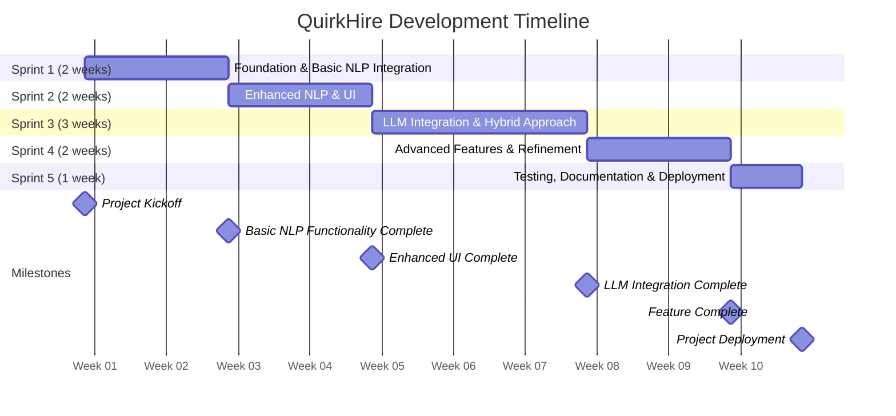

## Technical Architecture

### Core Technologies
- **Frontend**: React.js with Material-UI
- **Backend**: Django
- **Database**: Supabase
- **Machine Learning**: 
  * Sentence Transformers
  * Large Language Models via OpenRouter (Meta Llama 4 Maverick, NVIDIA Nemotron Super 49B)

### Detailed Component Architecture

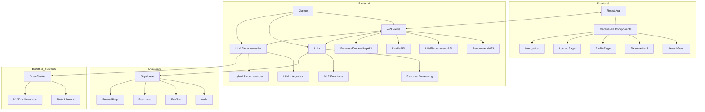

## Recommendation Engine Modes
1. **Traditional NLP Matching**
   - Uses sentence-transformers for semantic similarity
   - Calculates resume-job compatibility based on vector embeddings
   - Fast and lightweight matching

2. **LLM-Powered Matching**
   - Utilizes advanced language models (Llama 4 Maverick, NVIDIA Nemotron)
   - Provides nuanced, context-aware candidate evaluations
   - Generates detailed match reasoning

3. **Hybrid Matching**
   - Combines NLP and LLM approaches
   - Provides comprehensive candidate assessment
   - Balances speed and depth of analysis

## Recommendation Algorithm Comparison

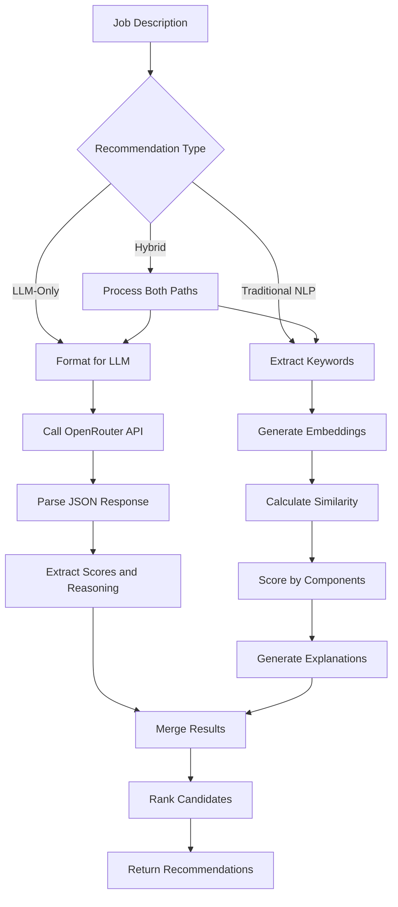

## Key Features

### Intelligent Matching
- Semantic skill and experience matching
- Contextual candidate evaluation
- Detailed match reasoning
- Multiple recommendation modes

### User Experience
- Intuitive resume card interface
- Detailed match insights
- Profile view notifications
- Flexible recommendation options

## System Architecture Diagram

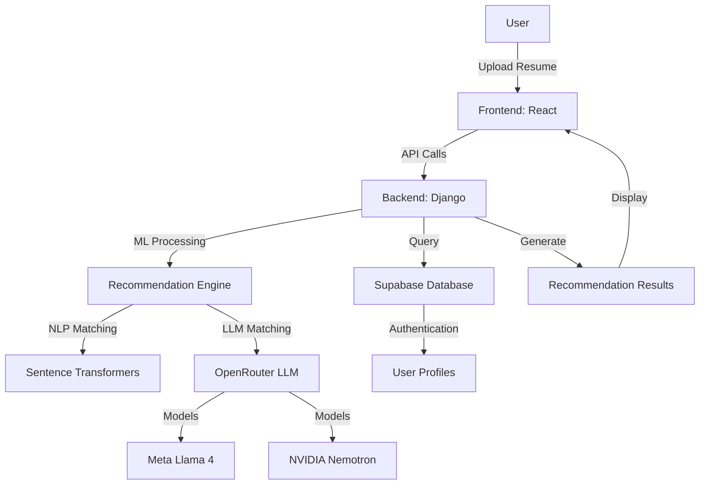

## Recommendation Workflow

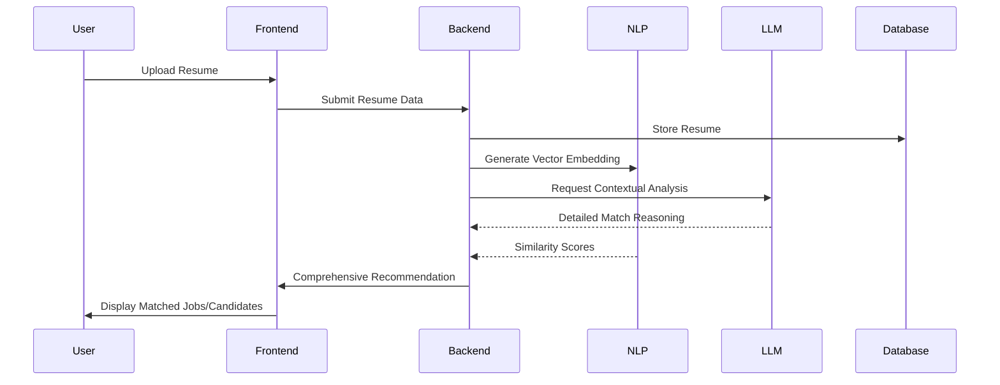

## Data Flow Diagram

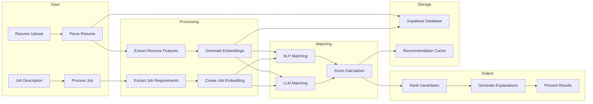

## LLM Prompt Engineering Architecture

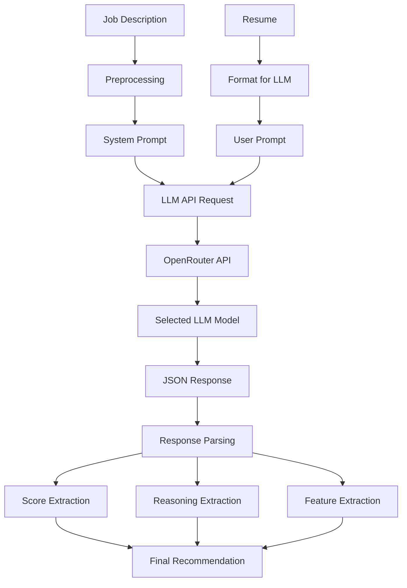

## User Journey Map

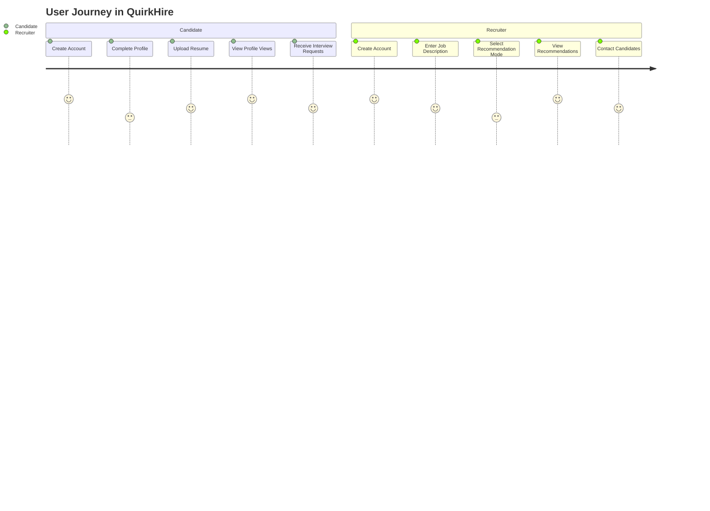

## Performance Metrics Visualization

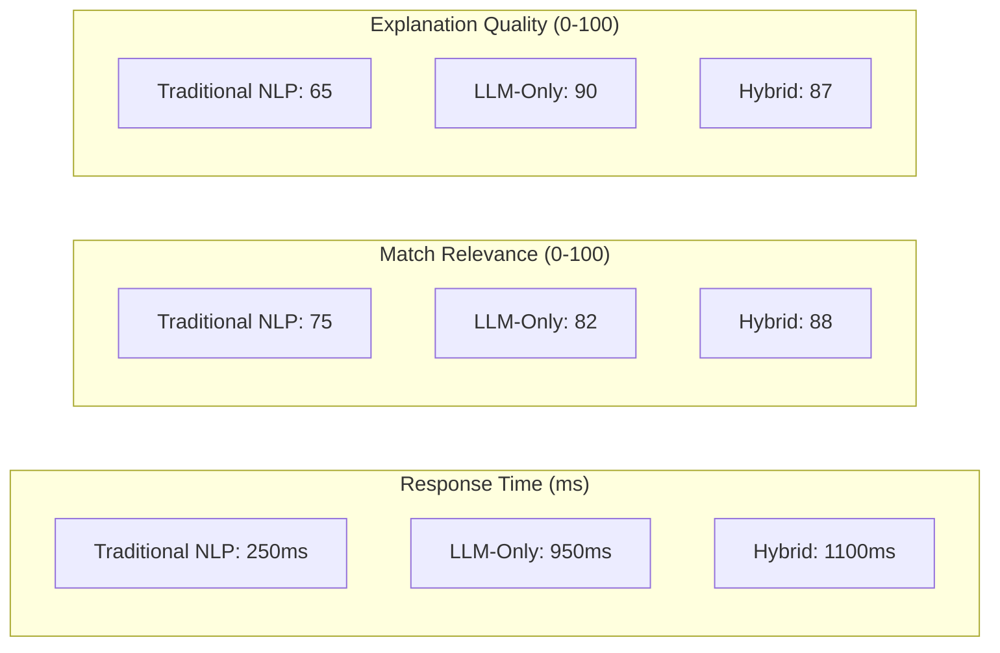

## Technology Stack Hierarchy

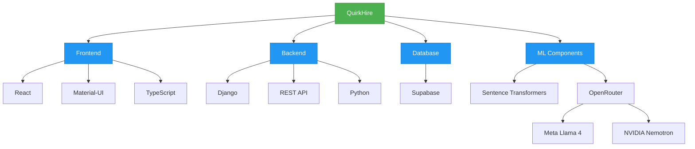

## Future Improvements

### Short-term Enhancements
- Support for additional LLM models
- Enhanced visualization of match factors
- Improved handling of domain-specific terminology
- Resume parsing optimization

### Long-term Vision
- Real-time collaborative filtering recommendations
- Industry-specific matching algorithms
- Automated job description enhancement
- Interview question generation based on resume gaps

## Conclusion

QuirkHire demonstrates the power of combining traditional NLP techniques with cutting-edge LLM capabilities to create a powerful, context-aware resume recommendation system. By following the CRISP-DM methodology and implementing the project through well-defined sprints, we've created a robust platform that effectively connects qualified candidates with relevant job opportunities.

The hybrid approach provides a balance of performance and insight, offering recruiters both rapid results and detailed explanations. The system's architecture ensures scalability and maintainability, while the user interface provides an intuitive experience for all users.

Through continued refinement and feature enhancement, QuirkHire aims to remain at the forefront of AI-powered recruitment technology, helping organizations find the best talent for their needs.

## Recommendation Models Comparison

| Feature | Traditional NLP | LLM-Based | Hybrid |
|---------|----------------|-----------|--------|
| **Technology Used** | Sentence Transformers, Vector Embeddings | Large Language Models (Llama 4, Nemotron) | Combines both NLP and LLM approaches |
| **Matching Mechanism** | Cosine similarity between vector embeddings | Contextual analysis and reasoning | Weighted combination of both methods |
| **Average Response Time** | Fast (200-300ms) | Slower (800-1000ms) | Slowest (1000-1200ms) |
| **Match Relevance Score** | Good (70-75/100) | Very Good (80-85/100) | Excellent (85-90/100) |
| **Explanation Quality** | Basic, limited to similarity factors | Detailed, nuanced, context-aware | Comprehensive with both statistical and contextual insights |
| **Resource Usage** | Low (local computation) | High (external API calls) | High (combines both) |
| **Cost** | Low | Higher (API costs) | Highest |
| **Key Strengths** | Speed, efficiency, works offline | Nuanced understanding, detailed reasoning, handles context | Best overall match quality, redundancy in case of failures |
| **Key Limitations** | Limited contextual understanding, basic explanations | API dependency, potential latency, cost | Complex implementation, highest latency, most expensive |
| **Best Used For** | Quick initial screenings, large volume processing | Detailed candidate assessment, executive positions | Critical positions requiring thorough evaluation |
| **Fallback Mechanism** | None | Falls back to default scores if API fails | Falls back to NLP if LLM unavailable |
| **Scaling Characteristics** | Scales well with large datasets | Limited by API rate limits and costs | Partially scalable (NLP component scales well) |
| **Implementation Complexity** | Moderate | Moderate (API integration) | High (combines both systems) |

This comparison highlights how each recommendation mode serves different needs within the recruitment process. The traditional NLP approach provides quick, cost-effective recommendations suitable for initial screenings. The LLM-based approach offers deeper insights with detailed reasoning, making it ideal for positions requiring careful evaluation. The hybrid approach combines the strengths of both methods to deliver the highest quality recommendations, though at the cost of increased complexity and processing time.
